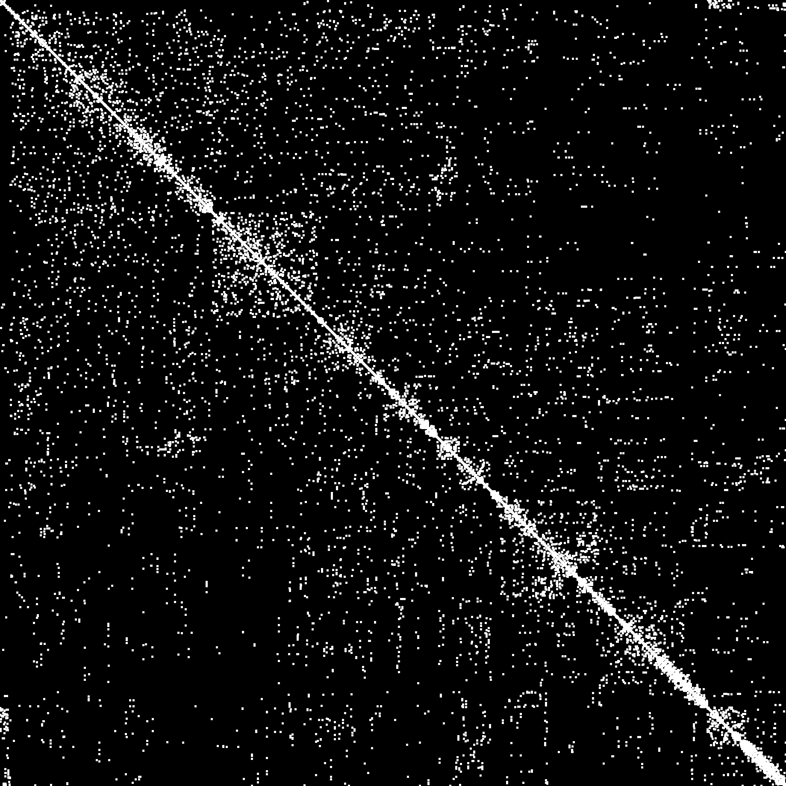
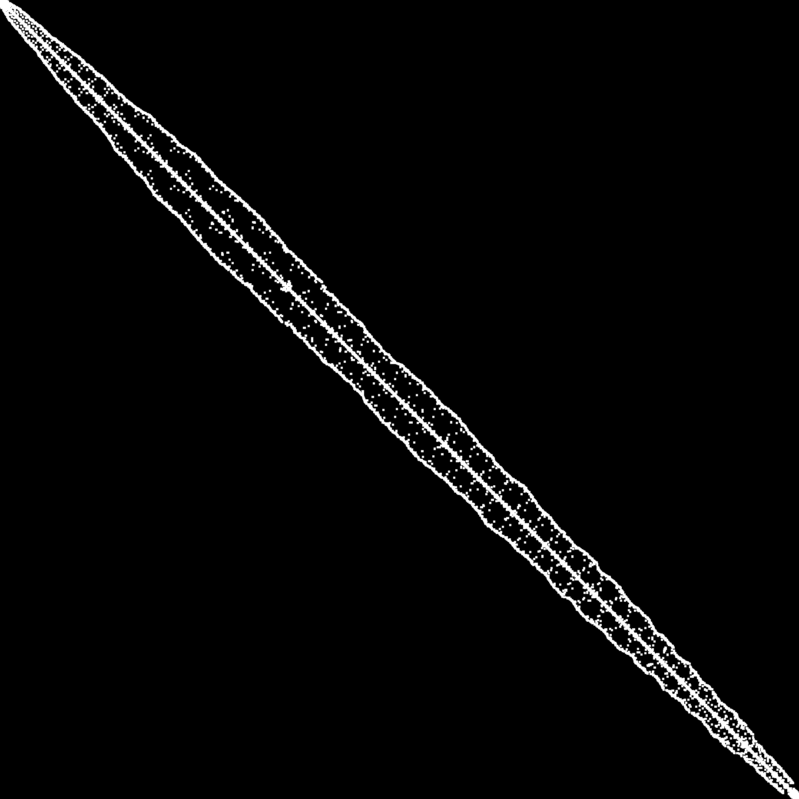

cuthill-mckee
=============
The reverse Cuthill-Mckee method is a fast and effective preconditioner for reducing the bandwidth of sparse linear systems.  When solving a positive semidefinite linear system using Cholesky factorization, it greatly reduces fill-in.  For example, here is the Laplacian matrix of the Stanford bunny:

*BEFORE:*



*AFTER:*



# example

```javacript
var coeffs = [
  [0, 0, 1],
  [0, 2, 3],
  [1, 1, 1],
  [2, 2, 1]
]

var perm = require('cuthill-mckee')(coeffs, 3)

console.log(perm)
```

# install

npm i cuthill-mckee

# usage

#### `require('cuthill-mckee')(list, n)`
This module takes the coefficients of a sparse matrix as input and gives permutation which reduces the fill-in (or bandwidth) of the matrix.

* `list` is a list of matrix coefficeints
* `n` is the number of rows & columns in the matrix

**Returns** A permutation encoded as an array which preconditions the matrix.

# license
(c) 2015 Mikola Lysenko. MIT
